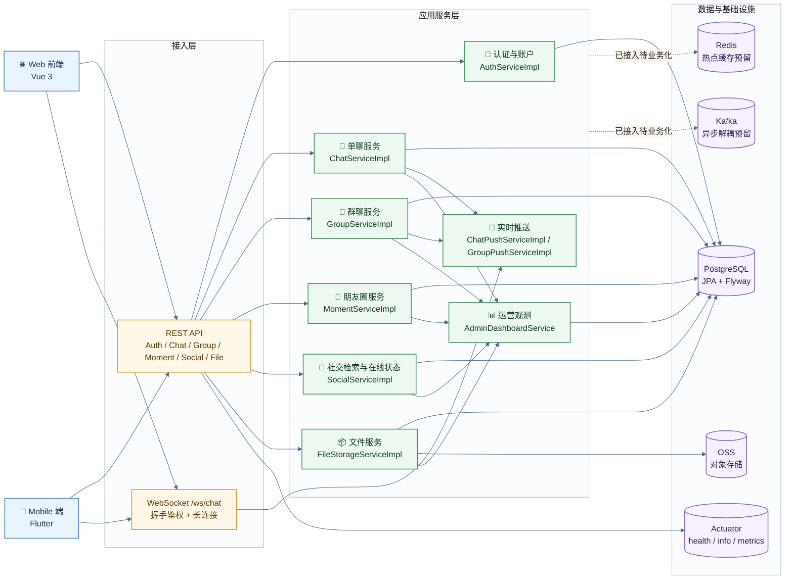
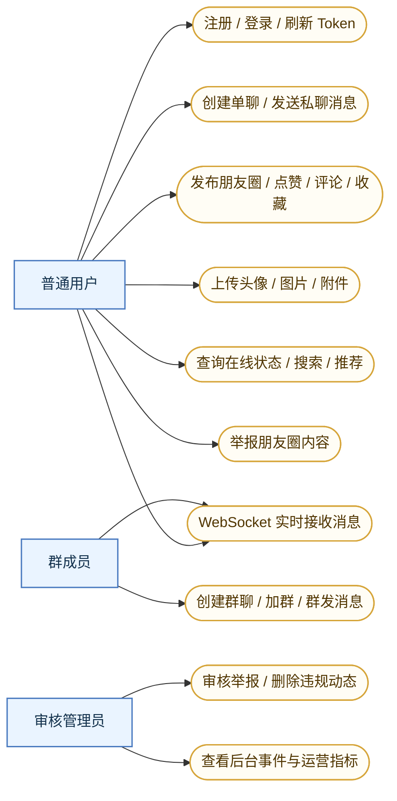
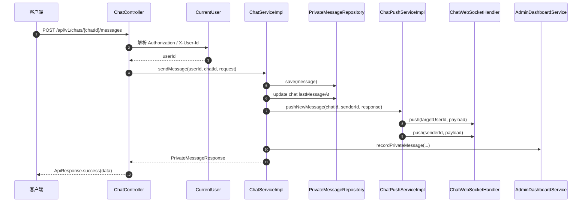

# Hello Chat Backend 高并发与安全性架构设计

本文基于 `backend` 目录当前实现撰写，内容同时覆盖两条线：

- 宏观架构：系统分层、运行时组件、数据流、扩展边界
- 代码落点：定位到具体类、方法、配置与查询实现

## 代码定位总览

| 层次 | 当前实现 | 代码定位 |
| --- | --- | --- |
| 应用启动 | Spring Boot 启动、调度开启 | `src/main/java/com/hellochat/backend/HelloChatApplication.java:7` |
| Web 接入层 | REST API、参数校验、统一返回 | `src/main/java/com/hellochat/backend/controller` |
| 认证边界 | Token 解析、当前用户提取 | `src/main/java/com/hellochat/backend/common/TokenProvider.java:13` `src/main/java/com/hellochat/backend/common/CurrentUser.java:5` |
| WebSocket 接入 | 握手鉴权、会话管理、实时推送 | `src/main/java/com/hellochat/backend/config/WebSocketConfig.java:13` `src/main/java/com/hellochat/backend/websocket/ChatWebSocketHandler.java:13` |
| 业务服务层 | 认证、单聊、群聊、朋友圈、社交、文件 | `src/main/java/com/hellochat/backend/service/impl` |
| 持久化层 | Spring Data JPA、分页、批量更新、自定义可见性查询 | `src/main/java/com/hellochat/backend/repository` |
| 数据结构演进 | Flyway 迁移 | `src/main/resources/db/migration` |
| 文件存储 | OSS 条件装配、上传校验、签名访问 | `src/main/java/com/hellochat/backend/config/OssConfig.java:10` `src/main/java/com/hellochat/backend/service/impl/FileStorageServiceImpl.java:25` |
| 可观测性 | Health、Metrics、后台事件采样与调度刷新 | `src/main/resources/application.yml:53` `src/main/java/com/hellochat/backend/service/AdminDashboardService.java:13` |
| 并发扩展预留 | Redis、Kafka 依赖与配置已接入 | `pom.xml:39` `src/main/resources/application.yml:16` |

## 后端现状判断

当前后端是一个单体式 Spring Boot IM 服务，业务模块边界清晰，事务边界明确，查询模型已按聊天、群聊、朋友圈、社交检索拆分完成，具备继续向高并发和更强安全治理演进的结构基础。

已经真正落地的能力：

- REST + WebSocket 双入口
- Spring Data JPA + PostgreSQL 持久化
- Flyway 结构迁移
- Token 认证、密码哈希、统一异常处理
- 群聊与单聊的实时推送
- 朋友圈可见性控制
- OSS 上传与签名访问
- Actuator 健康检查与指标暴露
- 调度式后台运营数据刷新

已经接入但还没有进入核心业务主链路的能力：

- Redis：依赖与配置存在，当前未看到 `RedisTemplate` / `StringRedisTemplate` / 缓存读写调用
- Kafka：依赖与配置存在，当前未看到生产者、消费者或事件主题读写

这意味着当前系统更准确的表述是：

- 具备高并发演进接口
- 尚未进入多节点、强异步、热点缓存主导的阶段

## 宏观架构图

## 详细架构图

```mermaid
%%{init: {"theme":"base","themeVariables":{"primaryColor":"#ffffff","primaryTextColor":"#1E293B","primaryBorderColor":"#64748B","lineColor":"#64748B","secondaryColor":"#F8FAFC","tertiaryColor":"#F1F5F9","fontFamily":"PingFang SC, Microsoft YaHei, sans-serif"}}}%%
flowchart TB
    subgraph Controller["Controller 层"]
        AuthC["AuthController<br/>/api/v1/auth"]
        ChatC["ChatController<br/>/api/v1/chats"]
        GroupC["GroupController<br/>/api/v1/groups"]
        MomentC["MomentController<br/>/api/v1/moments"]
        SocialC["SocialController<br/>/api/v1/social"]
        FileC["FileController<br/>/api/v1/files"]
    end

    subgraph Security["认证与安全边界"]
        CurrentUser["CurrentUser<br/>Header 提取"]
        Token["TokenProvider<br/>HMAC Token"]
        GEX["GlobalExceptionHandler<br/>统一异常出口"]
        Cors["WebConfig / WebSocketConfig<br/>跨域与握手策略"]
    end

    subgraph Service["Service 层"]
        AuthS["AuthServiceImpl"]
        ChatS["ChatServiceImpl"]
        GroupS["GroupServiceImpl"]
        MomentS["MomentServiceImpl"]
        SocialS["SocialServiceImpl"]
        FileS["FileStorageServiceImpl"]
        PushS["ChatPush / GroupPush"]
        AdminS["AdminDashboardService"]
    end

    subgraph Repository["Repository 层"]
        UserR["UserRepository"]
        AuthTokenR["AuthTokenRepository"]
        PrivateR["PrivateChatRepository<br/>PrivateMessageRepository"]
        GroupR["ChatGroupRepository<br/>GroupMemberRepository<br/>GroupMessageRepository"]
        MomentR["MomentRepository<br/>MomentReportRepository<br/>NotificationRepository"]
        SocialR["SearchHistoryRepository<br/>UserPresenceRepository"]
        FileR["FileAssetRepository"]
    end

    subgraph Infra["基础设施层"]
        DB[("PostgreSQL")]
        Flyway[("Flyway Migration")]
        WSMap[("ConcurrentHashMap Session Store")]
        OSS[("Aliyun OSS")]
        Redis[("Redis 预留")]
        Kafka[("Kafka 预留")]
    end

    AuthC --> CurrentUser
    ChatC --> CurrentUser
    GroupC --> CurrentUser
    MomentC --> CurrentUser
    SocialC --> CurrentUser
    FileC --> CurrentUser

    CurrentUser --> Token
    AuthC --> AuthS
    ChatC --> ChatS
    GroupC --> GroupS
    MomentC --> MomentS
    SocialC --> SocialS
    FileC --> FileS
    Controller --> GEX
    Controller --> Cors

    AuthS --> UserR
    AuthS --> AuthTokenR
    ChatS --> PrivateR
    ChatS --> FileR
    ChatS --> PushS
    ChatS --> AdminS
    GroupS --> GroupR
    GroupS --> FileR
    GroupS --> PushS
    GroupS --> AdminS
    MomentS --> MomentR
    MomentS --> FileR
    MomentS --> AdminS
    SocialS --> SocialR
    SocialS --> GroupR
    SocialS --> MomentR
    SocialS --> AdminS
    FileS --> FileR
    FileS --> OSS
    FileS --> AdminS

    UserR --> DB
    AuthTokenR --> DB
    PrivateR --> DB
    GroupR --> DB
    MomentR --> DB
    SocialR --> DB
    FileR --> DB
    Flyway --> DB
    PushS --> WSMap
    Service -. future hot path .-> Redis
    Service -. future async bus .-> Kafka

    classDef ctrl fill:#E8F1FF,stroke:#4B7BC0,color:#102A43;
    classDef sec fill:#FFF4E5,stroke:#D97706,color:#5B3400;
    classDef svc fill:#EAFBF2,stroke:#1F8A5B,color:#123524;
    classDef repo fill:#F5F3FF,stroke:#7C5CC4,color:#34255F;
    classDef infra fill:#F8FAFC,stroke:#64748B,color:#1E293B;

    class AuthC,ChatC,GroupC,MomentC,SocialC,FileC ctrl;
    class CurrentUser,Token,GEX,Cors sec;
    class AuthS,ChatS,GroupS,MomentS,SocialS,FileS,PushS,AdminS svc;
    class UserR,AuthTokenR,PrivateR,GroupR,MomentR,SocialR,FileR repo;
    class DB,Flyway,WSMap,OSS,Redis,Kafka infra;
```

## UML 类关系图

```mermaid
classDiagram
    class AuthController
    class ChatController
    class GroupController
    class MomentController
    class SocialController
    class FileController

    class CurrentUser {
      +requireUserId(request, tokenProvider) Long
    }
    class TokenProvider {
      +createAccessToken(userId) String
      +parseUserId(token) Long
    }
    class PasswordCodec {
      +encode(rawPassword) String
      +matches(rawPassword, encodedPassword) boolean
    }
    class GlobalExceptionHandler

    class AuthServiceImpl
    class ChatServiceImpl
    class GroupServiceImpl
    class MomentServiceImpl
    class SocialServiceImpl
    class FileStorageServiceImpl
    class ChatPushServiceImpl
    class GroupPushServiceImpl
    class AdminDashboardService

    class PrivateMessageRepository
    class GroupMessageRepository
    class MomentRepository
    class FileAssetRepository

    AuthController --> CurrentUser
    ChatController --> CurrentUser
    GroupController --> CurrentUser
    MomentController --> CurrentUser
    SocialController --> CurrentUser
    FileController --> CurrentUser
    CurrentUser --> TokenProvider

    AuthServiceImpl --> PasswordCodec
    AuthServiceImpl --> TokenProvider
    ChatServiceImpl --> ChatPushServiceImpl
    GroupServiceImpl --> GroupPushServiceImpl
    ChatServiceImpl --> AdminDashboardService
    GroupServiceImpl --> AdminDashboardService
    MomentServiceImpl --> AdminDashboardService
    SocialServiceImpl --> AdminDashboardService
    FileStorageServiceImpl --> AdminDashboardService

    ChatServiceImpl --> PrivateMessageRepository
    GroupServiceImpl --> GroupMessageRepository
    MomentServiceImpl --> MomentRepository
    FileStorageServiceImpl --> FileAssetRepository
```

## 用例图

## 单聊消息时序图

## 高并发设计

## 接入层并发模型

当前系统的并发入口天然分成两类：

- 同步请求流：`Controller -> Service -> Repository`
- 实时推送流：`Service -> PushService -> ChatWebSocketHandler`

代码落点：

- REST 入口集中在 `controller` 包，路由拆分明确，聊天、群聊、朋友圈、文件上传都已分离
- WebSocket 入口配置在 `src/main/java/com/hellochat/backend/config/WebSocketConfig.java:23`
- 单连接会话缓存落在 `src/main/java/com/hellochat/backend/websocket/ChatWebSocketHandler.java:15`

这套入口模型有两个优点：

- 写路径不会和长连接处理代码耦合在同一个控制器层
- 业务事务提交和消息推送职责已经拆开，后续迁移到 MQ 会比较顺手

## 事务边界设计

高频写操作基本都加了 `@Transactional`，事务粒度集中在 service 方法级别：

- 认证注册与刷新：`AuthServiceImpl.java:64` `AuthServiceImpl.java:104`
- 单聊创建、发消息、撤回、删除、已读：`ChatServiceImpl.java:74` `ChatServiceImpl.java:105` `ChatServiceImpl.java:210`
- 群聊建群、发消息、加群审核、公告、转让、禁言：`GroupServiceImpl.java:93` `GroupServiceImpl.java:345` `GroupServiceImpl.java:515`
- 朋友圈发帖、点赞、评论、举报、审核：`MomentServiceImpl.java:106` `MomentServiceImpl.java:252` `MomentServiceImpl.java:407` `MomentServiceImpl.java:442`
- 在线状态与搜索历史写入：`SocialServiceImpl.java:76` `SocialServiceImpl.java:107`

这种做法的价值在于：

- 单个业务动作能够维持本地原子性
- 聊天消息、群消息、朋友圈举报这类核心写操作不会出现半写入状态
- 后续如需拆分成本地事务 + 异步事件，可以直接围绕当前 service 边界展开

## 分页与批量更新设计

消息列表、搜索列表、朋友圈流、群文件列表都在 repository 层使用分页查询，页面大小做了上限控制：

- 单聊分页上限 `100`：`ChatServiceImpl.java:278`
- 群聊搜索分页上限 `100`：`GroupServiceImpl.java` 的 `pageRequest(...)` 调用链
- 朋友圈分页通过 `MomentRepository` 的 `Page<Moment>` 查询返回：`MomentRepository.java:27`

单聊已读状态使用批量 `update` 而不是逐条回写：

- `PrivateMessageRepository.markChatMessagesRead(...)`：`src/main/java/com/hellochat/backend/repository/PrivateMessageRepository.java:29`
- 调用点：`src/main/java/com/hellochat/backend/service/impl/ChatServiceImpl.java:213`

这一点对并发读写压力很重要：

- 已读回执不需要逐条加载消息实体
- 数据库端一次性完成状态变更
- 应用层对象构造成本明显更低

## 单聊并发写路径

单聊发消息路径很清晰：

- 成员校验：`ChatServiceImpl.java:107`
- 消息类型校验：`ChatServiceImpl.java:108`
- 文件所有权校验：`ChatServiceImpl.java:114`
- 消息落库：`ChatServiceImpl.java:125`
- 会话摘要更新：`ChatServiceImpl.java:135`
- 推送发送：`ChatServiceImpl.java:141`

并发收益来自三个设计点：

- `chatId` 维度消息分页与查询，避免全表扫描式读法
- `lastMessageId` / `lastMessageAt` 直接维护在 `PrivateChat` 上，列表页读取不需要每次聚合消息表
- 读回执与输入状态走推送通道，不阻塞 HTTP 主响应

## 群聊并发写路径

群聊是整个系统最靠近高并发场景的模块，当前设计重点在成员边界、消息广播和增量状态：

- 建群成员上限控制：`GroupServiceImpl.java:101`
- 发送前成员身份与禁言校验：`GroupServiceImpl.java:347`
- 附件消息归属校验：`GroupServiceImpl.java:362`
- 提及成员合法性校验：`GroupServiceImpl.java:380`
- 消息与 mention 明细拆表保存：`GroupServiceImpl.java:396` `GroupServiceImpl.java:397`
- 广播推送：`GroupPushServiceImpl.java:54`

群聊未读与提及统计也做了专门查询：

- 普通未读数：`GroupMessageRepository.java:27`
- 全量提及统计：`GroupMessageRepository.java:31`
- 基于 `lastReadAt` 的增量提及统计：`GroupMessageRepository.java:45`

这类查询结构说明群聊读模型已经在朝“会话聚合视图”演化，适合后续再叠加：

- Redis 未读数缓存
- 群会话收件箱预聚合
- Kafka 广播队列

## WebSocket 并发模型

当前 WebSocket 会话容器使用 `ConcurrentHashMap<Long, WebSocketSession>`：

- 会话注册：`ChatWebSocketHandler.java:18`
- 会话移除：`ChatWebSocketHandler.java:27`
- 消息推送：`ChatWebSocketHandler.java:34`

这是一种简单直接的单机并发模型，优点很明确：

- 线程安全
- 推送路径短
- 代码复杂度低

它的边界也很明确：

- 一个用户只保留一个 `WebSocketSession`
- 同一用户多端同时在线时，后连接会覆盖前连接
- 多实例部署时，节点之间没有共享会话路由

这意味着当前实时链路更适合：

- 单实例部署
- 小规模多用户在线
- 功能联调与教学型环境

面向更高并发和多节点时，最自然的升级路线是：

- `userId -> 多连接列表` 替代单值 `session`
- Redis 维护在线路由表
- Kafka 或 Redis Stream 承接跨节点推送事件
- 网关层做 sticky session 或路由透传

## 后台观测与业务主链路解耦

`AdminDashboardService` 使用 `REQUIRES_NEW` 和 `runSafely(...)`：

- 独立事务：`AdminDashboardService.java:29` `AdminDashboardService.java:37`
- 安全吞错：`AdminDashboardService.java:224`
- 定时刷新：`AdminDashboardService.java:25`

这套处理方式很适合并发系统里的“附加观测写入”：

- 主业务事务不会因为后台指标刷新失败而回滚
- 运营看板写入失败不会阻断发消息、发动态、上传文件等主链路
- 后续换成 Kafka 异步埋点时，改动面集中在这一层

## Redis 与 Kafka 的当前定位

依赖与配置已经具备：

- Redis 依赖：`pom.xml:39`
- Kafka 依赖：`pom.xml:43`
- Redis 配置：`application.yml:16`
- Kafka 配置：`application.yml:21`

当前代码里没有看到真正进入主链路的读写调用，这意味着：

- Redis 还没有承担热点缓存、会话缓存、限流计数器、分布式锁
- Kafka 还没有承担跨节点推送、通知异步化、审核事件流、削峰填谷

从设计视角看，这不是缺点，反而说明当前代码处于很适合演进的节点：

- 业务边界已经稳定
- 推送、观测、文件、社交、内容审核已经分层
- 可以在不重写控制器和 DTO 的前提下，把 Redis / Kafka 逐步引入热点路径

## 安全性架构设计

## 身份认证设计

认证核心由 `TokenProvider` 与 `CurrentUser` 组成：

- Token 生成：`TokenProvider.java:28`
- Token 解析：`TokenProvider.java:34`
- HMAC-SHA256 签名：`TokenProvider.java:50`
- 常量时间比较：`TokenProvider.java:61`
- 控制器提取用户身份：`CurrentUser.java:14`

这套设计的有效点：

- Access Token 带过期时间，不是永久凭证
- HMAC 校验避免客户端伪造 payload
- `MessageDigest.isEqual(...)` 与自定义常量时间比较减少时序攻击面

它的现实边界也需要明确写出来：

- Access Token 不是标准 JWT，而是自定义 `userId.expiresAt.signature` 结构
- Refresh Token 持久化在 `auth_tokens` 表中，刷新逻辑依赖数据库查询：`AuthServiceImpl.java:105`
- 当前没有看到设备指纹、IP 绑定、Token 黑名单广播等进一步收紧策略

## 密码安全设计

密码处理采用 PBKDF2：

- 随机盐长度：`PasswordCodec.java:14`
- 迭代次数：`PasswordCodec.java:15`
- 生成哈希：`PasswordCodec.java:37`
- 常量时间比较：`PasswordCodec.java:47`

这比直接 SHA-256 或明文比较安全得多，能够满足基础密码存储要求。

## WebSocket 鉴权设计

WebSocket 鉴权链路如下：

- 注册握手拦截器：`WebSocketConfig.java:25`
- 从查询参数提取 token：`TokenHandshakeInterceptor.java:43`
- 解析 userId 后写入 session attribute：`TokenHandshakeInterceptor.java:28`

安全收益：

- 长连接建立前就完成用户身份绑定
- 推送层不再重复做每条消息的认证解析

需要注意的点：

- token 在 URL query 中传递，容易进入浏览器历史、代理日志、接入层日志
- 更稳妥的演进方向是 Header、Cookie 或短期握手票据

## 资源访问控制设计

### 单聊与群聊权限边界

单聊：

- 会话成员校验：`ChatServiceImpl.java:234`
- 消息发送者校验：`ChatServiceImpl.java:243`
- 仅好友可发起会话：`ChatServiceImpl.java:258`

群聊：

- 活跃成员校验：`GroupServiceImpl.java` 内 `requireActiveMember(...)` 调用链
- 禁言与群关闭检查：`GroupServiceImpl.java:349`
- 群管理能力通过 `ROLE_OWNER` / `ROLE_ADMIN` / `ROLE_MEMBER` 区分

### 朋友圈可见性边界

朋友圈可见性控制是当前代码里最成熟的一块细粒度授权设计：

- 公开、好友、指定可见的 SQL 可见性判断：`MomentRepository.java:27`
- 指定用户可见校验：`MomentRepository.java:43`
- 用户主页可见性判断：`MomentRepository.java:54`
- 收藏列表可见性重算：`MomentRepository.java:86`

这说明朋友圈并不是在 service 层做“先查全量再内存过滤”，而是把授权边界下推到了查询层，这对性能和安全都更友好。

## 文件上传与对象存储安全设计

文件上传是当前安全设计里比较完整的一段：

- 上传控制器入口：`FileController.java:31`
- 上传前认证：`FileController.java:37`
- OSS 条件装配：`OssConfig.java:14`
- 场景校验：`FileStorageServiceImpl.java:153`
- 图片 / 文件 / 视频大小上限：`FileStorageServiceImpl.java:29`
- 对象 key 规范化：`FileStorageServiceImpl.java:181`
- 签名访问 URL：`FileStorageServiceImpl.java:138`

安全价值体现在：

- 不同业务场景对应不同内容类型与体积限制
- 上传对象路径不会直接使用原始文件名
- 公网访问可切换到签名重定向模式
- OSS 凭据缺失时不会静默写本地磁盘，而是明确失败并记录日志

## 全局异常与错误面收敛

统一异常出口位于 `GlobalExceptionHandler`：

- 参数校验失败：`GlobalExceptionHandler.java:20`
- 业务异常：`GlobalExceptionHandler.java:35`
- 超大文件异常：`GlobalExceptionHandler.java:42`
- 未知异常：`GlobalExceptionHandler.java:65`

这个设计让安全层有两个直接收益：

- 内部堆栈不会默认回传给客户端
- 常见业务错误形成稳定错误码，便于前端处理和审计

## 审核与运营安全设计

后台审核和敏感词采样已经接到了业务链路：

- 私聊消息采样：`AdminDashboardService.java:37`
- 群消息采样：`AdminDashboardService.java:47`
- 朋友圈动态采样：`AdminDashboardService.java:67`
- 举报登记：`MomentServiceImpl.java:407`
- 举报审核：`MomentServiceImpl.java:442`
- 敏感词检测：`AdminDashboardService.java:114`

朋友圈审核员权限来自配置：

- 管理员用户列表：`application.yml:42`
- 配置注入：`MomentServiceImpl.java:61`

这部分设计已经有“平台治理”雏形：

- 举报和审核不是单纯的内容删除
- 有独立的报告表、状态流转、通知补发与运营事件记录

## 当前安全风险清单

这部分是基于代码现状的真实评估，不是理论推演。

### 1. `CurrentUser` 存在 `X-User-Id` 回退入口

代码定位：

- `CurrentUser.java:22`

影响：

- 如果生产环境没有在网关层严格剥离 `X-User-Id`
- 只靠应用层就允许请求在缺少 `Authorization` 时伪造用户身份

这个设计适合联调，不适合公网生产。

### 2. 验证码接口直接返回验证码明文

代码定位：

- `AuthController.java:38`
- `AuthController.java:43`
- `AuthController.java:75`
- `AuthController.java:81`
- `AuthServiceImpl.java:50`

影响：

- 接口调用方可以直接拿到验证码值
- 如果这不是开发期临时能力，而是生产保留行为，认证链路形同明文发码回显

### 3. 资料更新与邮箱更新接口没有绑定当前登录用户

代码定位：

- `AuthController.java:106`
- `AuthController.java:112`
- `AuthServiceImpl.java:165`
- `AuthServiceImpl.java:196`

影响：

- `/api/v1/auth/profile/update` 直接使用请求体中的 `userId`
- `/api/v1/auth/email/update` 也直接使用请求体中的 `userId`
- 如果调用方能构造其他用户 ID，就可能越权修改资料或邮箱

这属于高优先级安全问题。

### 4. WebSocket token 放在 URL 查询参数

代码定位：

- `TokenHandshakeInterceptor.java:43`

影响：

- Token 更容易进入日志、浏览器历史、抓包记录
- 反向代理和接入日志也更容易带出凭证

### 5. CORS 与 WebSocket Origin 范围偏宽

代码定位：

- `WebConfig.java:12`
- `WebSocketConfig.java:27`

影响：

- 当前允许多个内网网段和通配域名
- 如果未来开放公网，建议把允许来源收紧到正式域名列表

## 面向高并发与安全生产化的改造落点

### 认证边界收紧

- 去掉 `CurrentUser.requireUserId(request)` 的 `X-User-Id` 生产回退
- `profile/update` 与 `email/update` 改成基于当前登录用户，不再信任请求体中的 `userId`
- 验证码接口改成只返回“发送成功”，不要回显验证码明文

### 实时推送分布式化

- `ConcurrentHashMap<Long, WebSocketSession>` 改成 `userId -> session list`
- Redis 保存在线路由
- Kafka 或 Redis Stream 广播跨节点消息事件
- 群广播从应用层 `forEach(member)` 迁移到事件总线或推送网关

### 热点数据缓存化

- 单聊会话摘要、未读数、群未读数、在线状态落到 Redis
- 热门话题推荐从 `MomentRepository.findTop100ByDeletedAtIsNullAndTagsIsNotNullOrderByCreatedAtDesc()` 的现算模式改成定时聚合
- 举报待审数、在线人数、消息吞吐量指标走缓存或预聚合表

### 写路径异步化

- `AdminDashboardService` 从同步 JDBC 写入改成消息队列异步消费
- 文件上传成功后的事件记录、敏感词统计、通知下发从主事务链路剥离
- 群提及、通知、推荐刷新改成异步任务

## 文档结论

从代码角度看，Hello Chat Backend 已经具备清晰的服务分层、事务边界和授权边界，能够支撑中等复杂度的 IM + 社交业务。它的高并发能力目前更多体现在结构上而不是基础设施落地上，Redis 与 Kafka 处于可接入状态，WebSocket 仍是单机路由模型。安全设计在密码学、Token、可见性查询、文件上传控制方面做得比较扎实，但认证回退、验证码回显、资料更新越权这几处需要尽快收紧。
