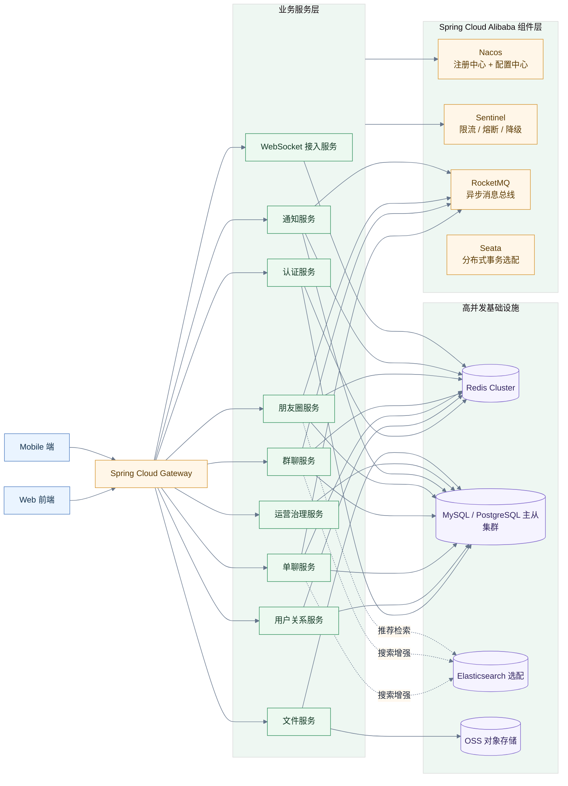
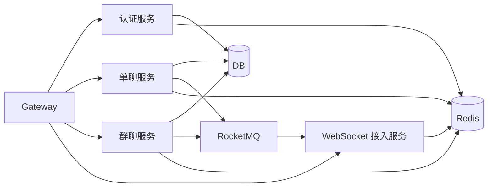
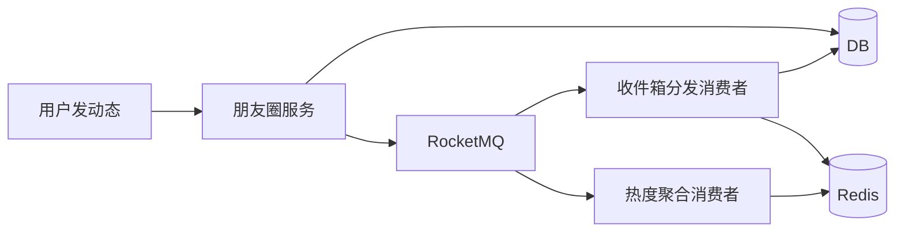

# Hello Chat 高并发改造建议文档

## 文档目标

本文面向当前 `hello_chat` 项目下一阶段的高并发改造，重点回答三个问题：

- 当前后端为什么还不适合直接承接高并发场景
- 基于 `Spring Cloud Alibaba` 应该如何拆分与演进
- 除了微服务框架，还需要补哪些高并发基础设计

本文默认以你当前代码为基础：`backend` 仍是单体 Spring Boot 服务，业务已覆盖认证、单聊、群聊、朋友圈、社交搜索、文件上传、WebSocket 推送和后台治理能力。

## 当前系统的并发瓶颈判断

从现有实现看，系统已经具备清晰的业务边界和事务边界，但高并发能力主要停留在代码结构层，还没有形成真正的分布式承载能力。

当前主要瓶颈：

- 单体部署，聊天、群聊、朋友圈、上传、审核都集中在一个 JVM 进程内
- WebSocket 会话保存在单机 `ConcurrentHashMap`，不支持多节点共享路由
- Redis 与 Kafka 依赖虽然已接入，但尚未进入核心主链路
- 多数热点查询仍直接访问 PostgreSQL，没有热点缓存层
- 群聊广播还是应用层逐成员推送，群规模扩大后容易放大 CPU、内存和网络压力
- 上传、审核、通知、统计等附加逻辑还有一部分跟主业务同进程运行
- 数据库层还没有读写分离、分库分表、消息流式削峰等设计

这意味着当前版本适合：

- 功能开发
- 中小规模联调
- 单机部署或低并发部署

它暂时还不适合：

- 大群实时广播
- 海量在线连接
- 高峰时段高频消息写入
- 热门朋友圈流量突增
- 多机房或多节点水平扩容

## 改造总原则

- 先把热点链路拆出来，再做大范围微服务化
- 先把状态外置，再做多实例扩容
- 先把同步重操作异步化，再谈高峰承载
- 先保证聊天链路，再优化社交、推荐、运营分析链路
- 当前代码里能复用的 service、repository、DTO 尽量复用，不做推倒重写

## 建议的目标架构

## Spring Cloud Alibaba 选型建议

## 1. Nacos

推荐用途：

- 服务注册与发现
- 多环境配置中心
- 动态刷新限流、开关、灰度参数

建议承载的配置：

- 各服务数据库连接
- Redis 连接参数
- RocketMQ topic 配置
- Sentinel 规则
- WebSocket 节点配置
- 文件上传大小限制
- 内容审核开关

当前项目迁移收益：

- 不再依赖单一 `application.yml` 管理全部配置
- 每个服务都能独立发布、独立扩容、独立变更配置
- 限流、降级、风控参数可以动态调整

## 2. Sentinel

推荐落点：

- 登录、验证码、刷新 Token 接口限流
- 文件上传接口限流
- 群消息发送接口限流
- 搜索接口热点参数限流
- 朋友圈列表、推荐接口熔断降级
- 后台敏感词或运营统计查询的保护

建议规则：

- 用户维度限流
- IP 维度限流
- 接口维度 QPS 限流
- 热点参数限流
- 下游异常比例熔断

适合当前项目的几个重点场景：

- 防止验证码接口被刷
- 防止单用户在群内短时间刷屏
- 防止大群文件上传或图片轰炸
- 防止搜索接口在高峰期拖垮数据库

## 3. RocketMQ

推荐承接的异步链路：

- 单聊消息投递事件
- 群聊广播事件
- 朋友圈点赞、评论、通知事件
- 内容举报与审核事件
- 上传成功后的后处理任务
- 运营日志、审计日志、消息埋点

当前项目最适合优先异步化的链路：

- `AdminDashboardService` 这一类附加统计写入
- 群消息广播
- 通知生成与投递
- 敏感词扫描命中事件

这样做的直接收益：

- HTTP 主链路更短
- 突发消息洪峰可以先进入消息队列削峰
- 后台统计、通知、审核不再阻塞聊天主写路径

## 4. Seata

Seata 不建议一开始就全量接入。

更适合后期引入的场景：

- 朋友圈删除联动通知、举报状态、审计记录多个服务同时写入
- 支付、积分、虚拟道具一类强一致业务
- 多服务跨库状态流转

对 Hello Chat 当前阶段，更推荐：

- 业务链路尽量通过最终一致性设计解决
- 真正跨服务强一致的场景再小范围引入 Seata

## 推荐的服务拆分方案

## 第一阶段：单体内模块重构

目标不是马上拆服务，而是先把当前 `backend` 内部调整成未来可拆的模块边界。

建议模块：

- `auth-module`
- `user-relation-module`
- `chat-module`
- `group-module`
- `moment-module`
- `file-module`
- `notification-module`
- `admin-governance-module`

这一阶段要做的事：

- service 包按领域重新梳理
- repository 按领域收束
- WebSocket 推送抽成独立接口层
- 运营统计逻辑从聊天主服务中剥离为事件消费者接口
- DTO 与领域模型边界明确化

## 第二阶段：优先拆出四个服务

建议优先拆分：

- 认证服务
- 聊天服务
- 群聊服务
- WebSocket 接入服务

理由：

- 这是并发压力最大的一条链路
- 最先决定整体扩容方式
- 能最早把长连接状态、消息写入、广播投递分开

建议关系：

## 第三阶段：社交与内容链路拆分

后续拆分：

- 朋友圈服务
- 通知服务
- 文件服务
- 搜索推荐服务
- 运营治理服务

理由：

- 朋友圈读多写多，流量模型与聊天不同
- 文件服务适合独立扩展和安全隔离
- 通知服务天然适合异步化
- 搜索推荐服务可以单独引入 ES、向量检索或画像逻辑

## Redis 高并发设计建议

Redis 在这个项目里不应该只是“以后再说”的备用组件，而应该进入核心路径。

推荐落点：

- Access Token 黑名单
- Refresh Token 会话信息缓存
- 用户在线状态
- `userId -> wsNode -> sessionSet` 路由表
- 单聊会话摘要缓存
- 群未读数缓存
- 热门群、热门话题缓存
- 搜索热点缓存
- 限流计数器
- 消息幂等键

推荐数据结构：

- `String`：配置、开关、状态位
- `Hash`：用户会话信息、群摘要
- `Set`：在线用户集合、群成员路由集合
- `ZSet`：最近会话、活跃排行榜、热度排序
- `Stream`：轻量异步事件流
- `Bitmap`：签到、在线标记一类海量状态

建议缓存策略：

- 高命中、低一致性要求的数据优先缓存
- 先写数据库再删缓存，避免脏读长期驻留
- 热门 Key 做本地缓存 + Redis 双层缓存
- 大群未读数采用异步聚合更新

## 消息链路高并发设计

聊天系统真正的核心在消息链路，而不是普通 CRUD。

建议把消息发送改造成四段式：

1. 接口层接收消息并快速校验
2. 主写服务完成消息落库与会话更新
3. 投递事件写入 RocketMQ
4. WebSocket 接入层消费事件并推送到在线终端

建议消息模型：

- 消息主表
- 会话摘要表
- 投递事件表
- 回执表
- 幂等表

建议能力补充：

- 客户端消息唯一 ID
- 服务端去重表
- ACK 确认机制
- 离线消息拉取
- 重试队列
- 死信队列

当前群聊广播最值得优先重写，因为现在是按成员列表循环推送，群人数大了以后压力会明显放大。

## WebSocket 高并发设计

当前 WebSocket 是单机模型，未来应升级为“接入层服务化”。

建议方案：

- WebSocket 服务独立部署
- 只处理握手、保活、路由和推送
- 不直接承担业务写库
- 业务服务通过 MQ 或 Redis Stream 把推送事件交给 WebSocket 层

关键设计：

- 多节点会话共享路由
- 用户多端同时在线支持
- 节点心跳与失效摘除
- 会话迁移与重连恢复
- 节点级连接数监控

推荐 Redis 路由结构：

- `ws:user:{userId}` -> 当前在线节点列表
- `ws:node:{nodeId}` -> 节点连接数、状态
- `ws:session:{sessionId}` -> 会话元数据

## 数据库高并发设计

## 读写分离

建议尽早引入：

- 主库负责写
- 从库负责查询、分页、列表流

适合优先迁移到从库的查询：

- 单聊消息历史
- 群消息历史
- 朋友圈流
- 搜索推荐结果
- 后台统计页面

## 分库分表

随着消息量增长，最先成为瓶颈的通常不是用户表，而是消息表。

优先考虑拆分：

- `private_messages`
- `group_messages`
- `notifications`
- `moment_comments`
- `moment_likes`

建议分片维度：

- 单聊消息按 `chatId`
- 群消息按 `groupId`
- 通知按 `userId`

建议方案：

- 早期用逻辑分表
- 中期引入 ShardingSphere
- 如果未来接入 SCA 全家桶，ShardingSphere 与微服务配合会比纯手工路由更稳

## 索引与冷热分层

建议：

- 最近 3 到 6 个月消息保留在热表
- 更老消息归档到历史表
- 搜索走 ES，不走主业务库模糊查询

## 朋友圈与推荐高并发设计

朋友圈与聊天流量模型不同，特点是：

- 读远多于写
- 热点内容极强
- 扇出读取压力大

建议方案：

- 发布动态时异步生成粉丝收件箱
- 热门动态走缓存预热
- 评论、点赞计数异步聚合
- 时间线采用分页游标，不建议长期依赖深分页
- 推荐和热门话题计算做离线或准实时任务

推荐架构：

## 文件上传高并发设计

文件服务建议单独拆分，原因不只在于体积大，也在于它的资源模型与业务消息完全不同。

建议改造：

- 文件直传 OSS
- 服务端只负责签名、校验和元数据记录
- 上传成功回调异步写数据库
- 图片压缩、视频转码、敏感图片扫描异步化

好处：

- 应用服务器不直接承压大文件流量
- 峰值上传时不会拖垮聊天主服务线程池
- 安全扫描和媒体处理可以独立扩展

## 限流、防刷与降级设计

高并发设计不是单纯加机器，必须带流量治理。

建议限流维度：

- 登录接口按 IP、邮箱、设备限流
- 验证码接口按 IP、邮箱、时间窗限流
- 发消息接口按用户、群、会话限流
- 上传接口按用户、文件类型、速率限流
- 搜索接口按关键词热点与用户速率限流

建议降级策略：

- 推荐服务超时，返回缓存结果
- 朋友圈热门流超时，返回基础时间流
- 搜索服务过载，关闭模糊扩展与联想词
- 后台统计过载，返回最近快照

## 线程池与资源隔离设计

建议把不同任务分开线程池：

- HTTP 业务线程池
- RocketMQ 消费线程池
- WebSocket 推送线程池
- 文件处理线程池
- 后台运营任务线程池

理由：

- 防止上传或大群广播挤占聊天主线程
- 防止运营统计拖慢业务主链路
- 便于做容量治理与监控

## 可观测性设计

建议引入完整的链路观测体系：

- Micrometer + Prometheus
- Grafana 仪表盘
- SkyWalking 或 Zipkin 链路追踪
- Loki / ELK 日志系统

重点监控指标：

- 登录成功率
- 消息发送 TPS
- 群广播延迟
- WebSocket 在线连接数
- RocketMQ 堆积量
- Redis 命中率
- 数据库慢查询数
- 文件上传失败率

## 改造优先级建议

### P0

- 引入 Nacos 配置中心与注册中心
- 引入 Sentinel 做登录、验证码、发消息、上传接口限流
- 引入 Redis 承担在线状态、会话路由、热点缓存
- 把 WebSocket 会话从单机内存状态改成外置路由
- 把 `AdminDashboardService` 和通知类附加逻辑异步化

### P1

- 引入 RocketMQ，重构聊天与群聊投递链路
- 拆出 WebSocket 接入服务
- 拆出认证服务、聊天服务、群聊服务
- 实现 ACK、离线消息、消息幂等

### P2

- 读写分离
- 消息表分表
- 朋友圈收件箱模型
- 搜索与推荐独立服务化

### P3

- 引入 ES
- 运营治理服务独立化
- 灰度发布、动态开关、弹性扩容自动化
- 分布式事务或更完整最终一致性框架

## 建议的技术栈组合

推荐组合：

- `Spring Cloud Gateway`
- `Spring Cloud Alibaba Nacos`
- `Spring Cloud Alibaba Sentinel`
- `Spring Cloud Alibaba RocketMQ`
- `Redis Cluster`
- `ShardingSphere`
- `Prometheus + Grafana`
- `SkyWalking`
- `OSS + 异步媒体处理`

选配：

- `Seata`
- `Elasticsearch`
- `Canal`

## 结论

Hello Chat 的高并发改造不应该从“把单体直接拆成很多服务”开始，而应该从聊天主链路、长连接状态、异步投递、缓存承载和流量治理开始。`Spring Cloud Alibaba` 在这个项目中的价值，不只是提供注册发现，而是把注册中心、配置中心、限流降级、消息总线这一整套高并发所需能力统一起来。真正的高并发能力将来自三类组合：

- 服务拆分与状态外置
- Redis + RocketMQ 驱动的异步化与缓存化
- Sentinel + 网关 + 观测系统支撑的流量治理

如果下一步进入代码改造，最值得先做的是：

- 接入 `Nacos + Sentinel`
- 把 WebSocket 路由迁到 Redis
- 把聊天与群聊投递链路迁到 RocketMQ
- 逐步拆出 `auth / chat / group / ws-gateway` 四个核心服务
