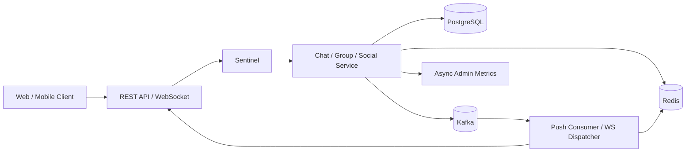
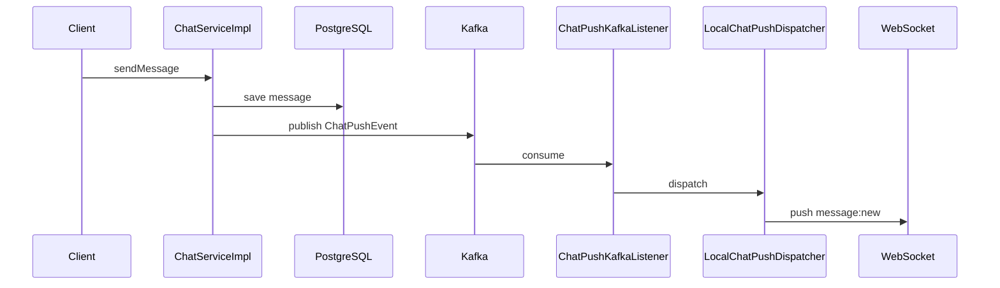
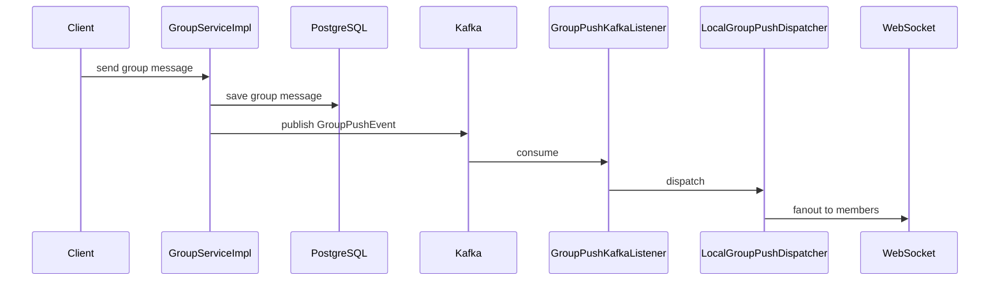
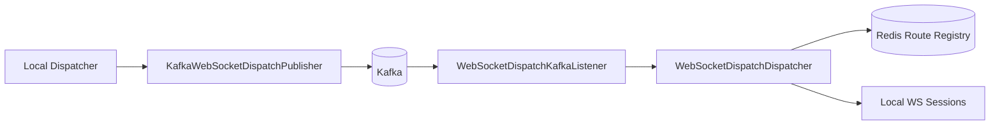

# Hello Chat 高并发设计与改造总览

日期：2026-06-10

## 文档定位

这份文档聚焦两个问题：

- Hello Chat 后端当前为了支撑高并发、横向扩展、热点流量治理，已经完成了哪些结构性改造
- 这些改造分别落在什么层次、解决什么问题、对应到哪些代码位置

本文不把项目当作课程作业描述，而是把它当作一个持续演进的即时通信系统来看待，重点关注消息热路径、缓存承载、异步事件、节点路由、流量治理与安全边界。

## 架构目标

当前这轮改造的核心目标不是一步拆成微服务，而是先把最容易成为瓶颈的同步热路径拆开：

- 把热点状态从单机内存挪到 Redis
- 把消息写入与消息推送解耦
- 把热点入口纳入流量控制
- 把后续服务拆分所需的配置中心、服务发现、事件总线、节点路由基础打好

对应到即时通信场景，这意味着系统需要从下面这种模式演进：

```text
HTTP / WebSocket 请求
  -> Controller
  -> Service
  -> 数据库写入
  -> 同步推送 WebSocket
  -> 同步写统计
```

演进为：

```text
HTTP / WebSocket 请求
  -> Controller
  -> Sentinel 限流
  -> Service
  -> 数据库写入
  -> Redis 热数据更新
  -> Kafka 事件发布
  -> Kafka 消费者异步推送
  -> 异步统计 / 异步运营记录
```

## 当前高并发总体设计



这里有四条主线：

- 请求入口治理：Sentinel 对热点接口做限流
- 热数据承载：Redis 承接在线状态、路由、未读、会话摘要
- 事件解耦：Kafka 承接消息推送事件
- 观察与运营：异步线程池承接后台统计类写入

## 改造分层

### 1. 接入层治理

当前热点接口已经接入 Sentinel：

- 验证码发送
- 登录
- 单聊发消息
- 群聊发消息
- 群 `@all`
- 文件上传

主要代码：

- `backend/src/main/java/com/hellochat/backend/sentinel/SentinelResourceNames.java`
- `backend/src/main/java/com/hellochat/backend/sentinel/SentinelBlockHandlers.java`
- `backend/src/main/java/com/hellochat/backend/sentinel/SentinelRuleProperties.java`
- `backend/src/main/java/com/hellochat/backend/sentinel/SentinelRuleConfig.java`
- `backend/src/main/java/com/hellochat/backend/controller/AuthController.java`
- `backend/src/main/java/com/hellochat/backend/controller/ChatController.java`
- `backend/src/main/java/com/hellochat/backend/controller/GroupController.java`
- `backend/src/main/java/com/hellochat/backend/controller/FileController.java`

这一层解决的是入口被打爆的问题。它不会让系统变快，但可以避免系统在流量高峰时被无限制拖死。

### 2. 基础设施接入层

为了让项目具备继续往服务化、配置化演进的基础，后端引入了 Spring Cloud Alibaba 相关能力。

主要代码：

- `backend/pom.xml`
- `backend/src/main/java/com/hellochat/backend/HelloChatApplication.java`
- `backend/src/main/java/com/hellochat/backend/config/HighConcurrencyProperties.java`
- `backend/src/main/resources/application.yml`

当前已经落地的能力：

- Nacos Discovery 开关
- Nacos Config 开关
- Sentinel 控制台接入
- Kafka 生产者 / 消费者序列化配置
- 节点编号、话题名称、线程池参数、事件去重 TTL 等并发配置

这一层解决的是“后面还能不能继续扩”的问题。

## Redis 热数据设计

### 设计动机

即时通信系统中最容易形成数据库热点的并不是所有业务，而是下面几类高频状态：

- 用户在线状态
- WebSocket 会话路由
- 单聊未读数
- 群聊未读数
- 群 `@提及` 未读数
- 群公告未读状态
- 会话摘要

如果这些数据全部回源数据库，系统在高并发下很快会出现：

- 列表查询抖动
- 未读数统计成本过高
- 同一会话反复统计
- 多节点路由无法共享状态

### 已完成的 Redis 接入

#### 在线状态与节点路由

主要代码：

- `backend/src/main/java/com/hellochat/backend/websocket/UserSessionRegistry.java`
- `backend/src/main/java/com/hellochat/backend/websocket/RedisBackedUserSessionRegistry.java`
- `backend/src/main/java/com/hellochat/backend/websocket/ChatWebSocketHandler.java`
- `backend/src/main/java/com/hellochat/backend/cache/PresenceCacheService.java`
- `backend/src/main/java/com/hellochat/backend/service/impl/SocialServiceImpl.java`

当前效果：

- 用户不再只绑定到单机 `ConcurrentHashMap`
- 同一用户可以多端同时在线
- WebSocket 路由具备跨节点共享能力
- 社交在线状态读取优先命中 Redis

#### 单聊热数据

主要代码：

- `backend/src/main/java/com/hellochat/backend/cache/ChatHotCacheService.java`
- `backend/src/main/java/com/hellochat/backend/cache/ChatSummaryCacheValue.java`
- `backend/src/main/java/com/hellochat/backend/service/impl/ChatServiceImpl.java`
- `backend/src/main/java/com/hellochat/backend/dto/PrivateChatResponse.java`

缓存内容：

- 单聊未读数
- 单聊会话摘要

接入路径：

- `listChats`
- `sendMessage`
- 已读回写

#### 群聊热数据

主要代码：

- `backend/src/main/java/com/hellochat/backend/cache/GroupHotCacheService.java`
- `backend/src/main/java/com/hellochat/backend/cache/GroupSummaryCacheValue.java`
- `backend/src/main/java/com/hellochat/backend/service/impl/GroupServiceImpl.java`
- `backend/src/main/java/com/hellochat/backend/repository/GroupMessageRepository.java`

缓存内容：

- 群未读数
- 群 `@提及` 未读数
- 群公告未读状态
- 群摘要

接入路径：

- `listMyGroups`
- `sendMessage`
- `markGroupAsRead`
- `markNoticeRead`
- `updateNotice`
- `createGroup`
- `joinByInviteCode`
- `addMembers`

### Redis 设计收益

- 把最频繁的读压力从数据库转移出去
- 让会话列表、群列表更适合高频刷新
- 为多节点 WebSocket 分发提供共享状态
- 为后续幂等门闩、限流计数器、死信补偿留下统一缓存基础

## Kafka 事件解耦设计

### 设计动机

在即时通信系统中，最典型的高并发问题是“写库成功后还要马上同步推送给很多终端”。如果继续保持同步直推，会带来几个问题：

- 请求线程被推送逻辑占住
- 群成员越多，请求耗时越不稳定
- 多节点 WebSocket 场景下，路由和推送耦合过深
- 一旦推送失败，业务线程也被牵连

因此这轮改造把“写消息”和“推消息”拆开了。

### 单聊链路



主要代码：

- `backend/src/main/java/com/hellochat/backend/service/impl/ChatPushServiceImpl.java`
- `backend/src/main/java/com/hellochat/backend/service/ChatPushKafkaListener.java`
- `backend/src/main/java/com/hellochat/backend/service/LocalChatPushDispatcher.java`
- `backend/src/main/java/com/hellochat/backend/service/event/ChatPushEvent.java`

### 群聊链路



主要代码：

- `backend/src/main/java/com/hellochat/backend/service/impl/GroupPushServiceImpl.java`
- `backend/src/main/java/com/hellochat/backend/service/GroupPushKafkaListener.java`
- `backend/src/main/java/com/hellochat/backend/service/LocalGroupPushDispatcher.java`
- `backend/src/main/java/com/hellochat/backend/service/event/GroupPushEvent.java`

### WebSocket 分发链路

Kafka 不直接把消息推给 WebSocket，会再经过一层节点路由分发：



主要代码：

- `backend/src/main/java/com/hellochat/backend/websocket/KafkaWebSocketDispatchPublisher.java`
- `backend/src/main/java/com/hellochat/backend/websocket/WebSocketDispatchKafkaListener.java`
- `backend/src/main/java/com/hellochat/backend/websocket/WebSocketDispatchDispatcher.java`
- `backend/src/main/java/com/hellochat/backend/websocket/WebSocketDispatchEvent.java`

### 这一层的收益

- 请求线程不再承担所有推送成本
- 群广播不再和数据库写入强耦合
- 多节点路由与推送路径清晰分层
- 未来补充重试、死信、削峰、回放更容易

## Kafka 幂等消费与重复推送防护

### 问题来源

一旦系统进入 Kafka 驱动模式，就必须正视一个事实：消息中间件天然可能出现重复投递、消费重试、生产端 fallback 重入。

如果没有幂等门闩，用户侧会看到：

- 同一条单聊消息被推两次
- 同一条群消息被重复广播
- WebSocket fallback 场景下重复下发

### 已完成的防护

这轮已经把三条链统一补上了 `eventId`：

- `ChatPushEvent`
- `GroupPushEvent`
- `WebSocketDispatchEvent`

新增去重服务：

- `backend/src/main/java/com/hellochat/backend/cache/KafkaEventDedupService.java`

去重接入位置：

- `backend/src/main/java/com/hellochat/backend/service/ChatPushKafkaListener.java`
- `backend/src/main/java/com/hellochat/backend/service/GroupPushKafkaListener.java`
- `backend/src/main/java/com/hellochat/backend/websocket/WebSocketDispatchDispatcher.java`

配置项：

- `hello-chat.concurrency.kafka-event-dedup-ttl-seconds`

### 当前效果

- Kafka 重复投递不会直接放大成重复消息推送
- WebSocket 分发 fallback 的重复进入也会被 Redis 门闩挡住
- 幂等控制已经从“业务层假设不会重复”变成“基础设施层显式防重”

## 异步线程池与运营写入剥离

除了消息推送，系统里还有一类很容易被忽略但会拖慢主链路的逻辑：运营统计、后台记录、敏感词命中记录。

这轮已经把这一块从热路径里剥离出来。

主要代码：

- `backend/src/main/java/com/hellochat/backend/config/AsyncConfig.java`
- `backend/src/main/java/com/hellochat/backend/config/HighConcurrencyProperties.java`
- `backend/src/main/java/com/hellochat/backend/service/AdminDashboardAsyncService.java`
- `backend/src/main/java/com/hellochat/backend/service/impl/ChatServiceImpl.java`
- `backend/src/main/java/com/hellochat/backend/service/impl/GroupServiceImpl.java`
- `backend/src/main/java/com/hellochat/backend/service/impl/MomentServiceImpl.java`
- `backend/src/main/java/com/hellochat/backend/service/impl/SocialServiceImpl.java`
- `backend/src/main/java/com/hellochat/backend/service/impl/FileStorageServiceImpl.java`

当前收益：

- 主业务响应时间更稳定
- 后台记录不再同步阻塞发消息、发动态、上传文件
- 后续扩展消息审计、统计上报、告警事件会更顺手

## 配置层改造

当前高并发相关配置已经集中进入 `hello-chat.concurrency` 与 `hello-chat.sentinel`：

主要配置文件：

- `backend/src/main/resources/application.yml`

关键参数包括：

- `node-id`
- `websocket-route-ttl-seconds`
- `websocket-kafka-enabled`
- `websocket-dispatch-topic`
- `chat-push-topic`
- `group-push-topic`
- `kafka-event-dedup-ttl-seconds`
- `event-core-pool-size`
- `event-max-pool-size`
- `event-queue-capacity`
- 各类 Sentinel QPS 阈值

这一层的重要性在于：系统的并发治理能力不再全部写死在代码里，后续可以逐步接入配置中心做动态调整。

## 安全性与高并发的结合点

高并发架构和安全架构在这里不是两套互不相干的设计，它们有几个明显的交点：

- Sentinel 限流本身就是对暴力请求与异常洪峰的第一道防线
- Kafka 事件 ID 与 Redis 幂等门闩既服务稳定性，也服务安全边界，避免重复消息被放大
- WebSocket 握手鉴权和 Redis 路由共享，避免匿名长连接进入多节点路由层
- 文件上传路径与主业务路径分离，方便后续独立加白名单、扫描、配额与审计

## 当前已经完成的总体改动清单

### Spring Cloud Alibaba 基础接入

- 引入 Nacos Config / Discovery
- 引入 Sentinel
- 开启高并发配置承载类

### 单聊链路

- 消息推送 Kafka 化
- Redis 承载未读与摘要
- 已读与推送分层

### 群聊链路

- 群消息推送 Kafka 化
- Redis 承载未读、提及未读、公告未读、群摘要
- 群列表读取优先命中缓存

### WebSocket 层

- 多节点 Redis 路由注册
- Kafka 分发能力
- 分发前去重判断

### 运营与观测

- 异步线程池
- 异步后台记录

## 当前仍未完成但已经明确的方向

- Kafka 重试与死信处理
- 业务级幂等键，而不只是事件级门闩
- 更细粒度的用户级 / 群级限流
- Kafka 消费积压与 Redis 命中率监控
- `ws-gateway / chat / group` 服务边界拆分
- 后续读写分离、分库分表、消息表冷热分层

## 验证情况

当前这轮高并发改造已经多次执行后端编译验证：

```powershell
cd backend
mvn -s .mvn-local-settings.xml "-Dmaven.repo.local=.m2repo" -q -DskipTests compile
```

结果：

- 编译通过

## 结论

这次改造最关键的变化，不是简单“多接了几个中间件”，而是系统的主干思路已经发生了变化：

- 热状态开始外置到 Redis
- 消息推送开始通过 Kafka 解耦
- 多节点路由开始摆脱单机内存
- 热点入口开始进入 Sentinel 流量治理
- 重复消费开始进入显式幂等控制

这意味着 Hello Chat 已经从一个偏单体、偏同步直推的即时通信后端，演进到了一个更接近生产化高并发架构的阶段。后续继续往服务拆分、死信治理、消息监控、分库分表推进时，已经不需要推倒重来，而是在现有骨架上继续深化。
